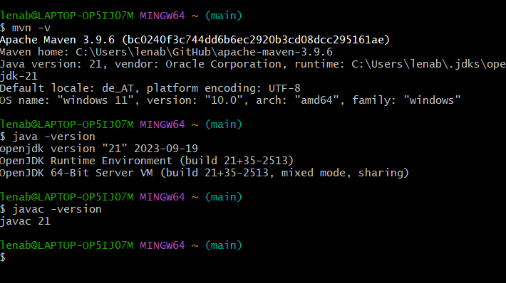
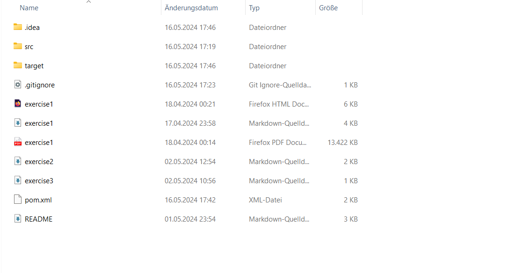
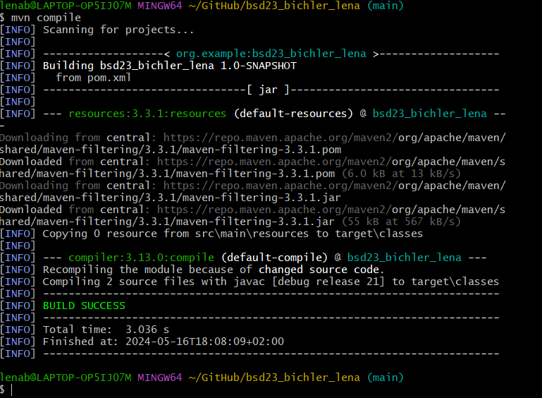

# Documentation of exercise3
This exercise teaches us more about GitHub and paths and also the maven calss in intellij.
## Documenting The Versions And Mvn - v

This is the documentation of my Intellij versions and the proof of mvn -v.
I don't use the LTS version, so it is different than the example photos.

## The Additional File

A new file was added - the target file.

## mvn compile

As seen in the screenshot, the mvn compile worked. Initially, there were some complications with JAVA_HOME, because it worked on two seperate terminals/bash, but it didn't work in the Intellij Terminal directly when I first tried it.

