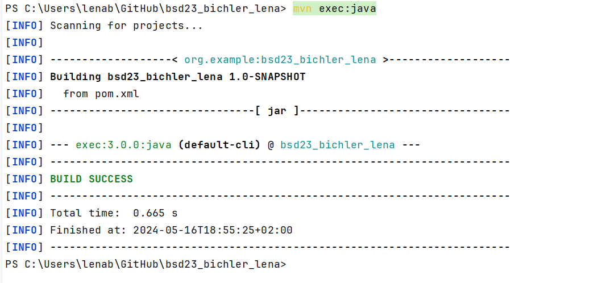

# Documentation of exercise3
This exercise delves into GitHub, file paths, and Maven integration in IntelliJ.
## Documenting The Versions And Mvn - v

This is the documentation of my Intellij versions as well as the output of mvn -v command to confirm the Maven installation.
Notably, while the example images in the instructions show the usage of the LTS version, my version doesn't use LTS, as seen here.

## The Additional File

A new file was added - the target file. It is a byproduct of the Maven build process, and shows target files being generated during compilation.

## mvn compile

As seen in the screenshot, the mvn compile worked. Initially, there were some complications with JAVA_HOME, because it worked on two seperate terminals/bash, but it didn't work in the Intellij Terminal directly when I first tried it.

## mvn exec:java

To execute the Java class using Maven, the mvn exec:java command was employed. I had some challenges when trying the mvn exec:java, because I forgot to use mvn compile after adding the new build block in pom.xml. After finding out what the problem was and fixing it, it worked.

## Struggles and Solutions
Throughout the exercise, several problems were encountered and resolved:
   - Setting up Environment Variables: Initial difficulties arose due to misconfiguration of the environment variables. Troubleshooting involved verifying the variable's value and ensuring alignment between the IntelliJ and system settings.

   - Understanding Maven Execution: Challenges were faced when executing Maven commands directly in the IntelliJ Terminal. However, by referencing the correct Maven build lifecycle phases and syntax, successful execution was achieved.
