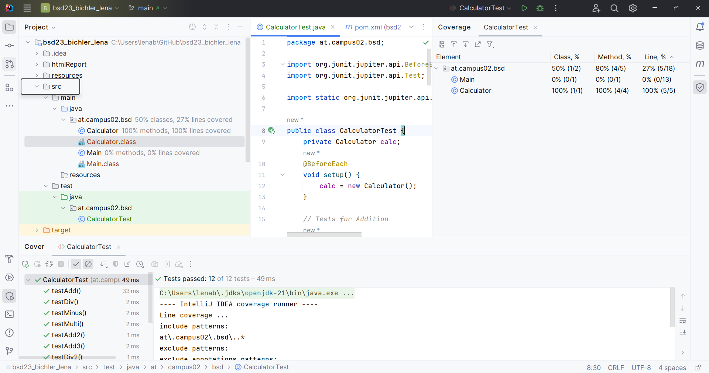
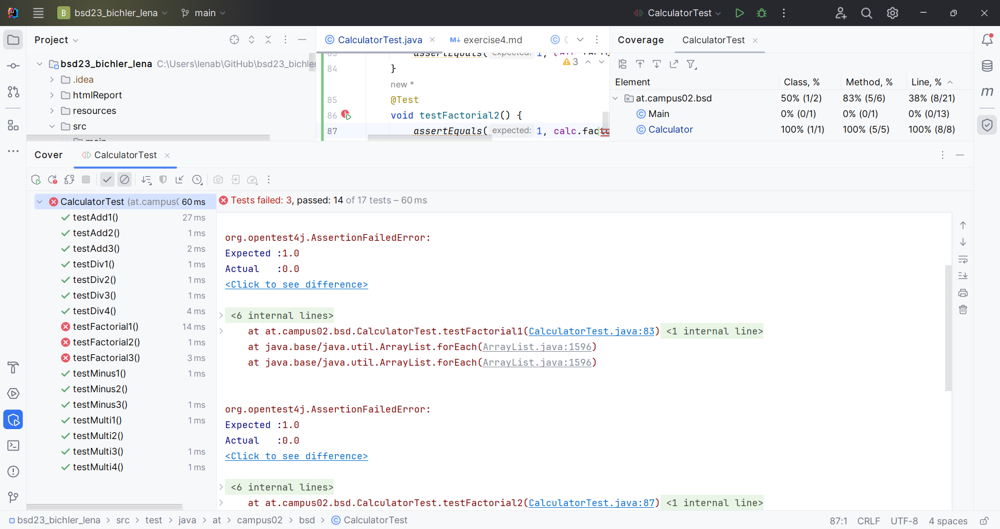
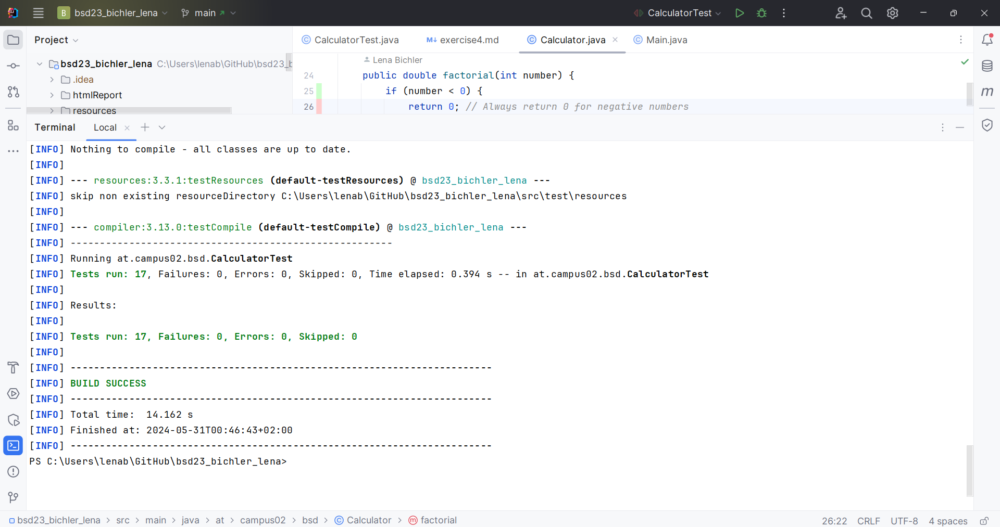

# First JUnit Test
In this exercise we are creating our first JUnit Tests and working with maven.
## My Created JUnit Tests

### Addition
- `testAdd1`: Testing addition of positive numbers (2 + 3)
- `testAdd2`: Testing addition of negative numbers (-36 + -5)
- `testAdd3`: Testing addition of positive and negative numbers (-3 + 58)

### Subtraction
- `testMinus1`: Testing subtraction of positive numbers (6 - 5)
- `testMinus2`: Testing subtraction of negative and negative numbers (60 - 82)
- `testMinus3`: Testing subtraction of negative numbers (-10 - -86)

### Multiplication
- `testMulti1`: Testing multiplication of positive numbers (3 * 3)
- `testMulti2`: Testing multiplication by zero (5 * 0)
- `testMulti3`: Testing multiplication of positive and negative numbers (6 * -8)
- `testMulti4`: Testing multiplication of negative numbers (-2 * -2)

### Division
- `testDiv1`: Testing division of positive numbers (4 / 2)
- `testDiv2`: Testing division of negative numbers (-72 / -9)
- `testDiv3`: Testing division of positive and negative numbers (6 / -6)
- `testDiv4`: Testing division by zero (8 / 0, expects ArithmeticException)

## Run With Coverage

## Factorial Not Yet Implemented
### Testcases
- `testFactorial1`: Tests if the factorial of 0 is correctly calculated as 1.
- `testFactorial2`: Tests if the factorial of 1 is correctly calculated as 1.
- `testFactorial3`: Tests if the factorial of 6 is correctly calculated as 720.

## After Correct Implementation
After the Method was correctly implemented everything worked really well.
