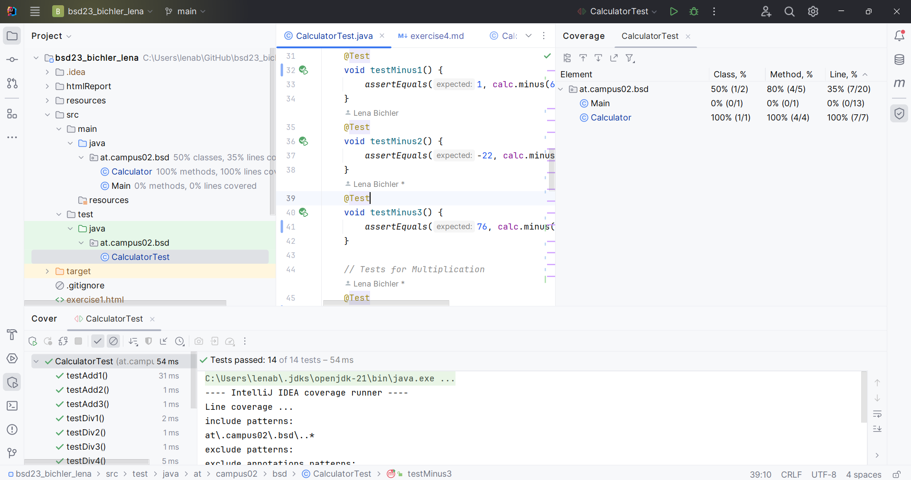

# First JUnit Test
In this exercise we are creating our first JUnit Tests and working with maven.
## My Created JUnit Tests
We had to create 3 Tests per arithmetic operation, making sure we cover some cases to test
- Addition
   I made sure that my calculation is able to calculate two negative numbers together, making sure there is no error there.

   @Test
    void testAdd2() {
        assertEquals(-41, calc.add(-36, -5));
    }

- Subtraction
    Same as previously mentioned, I made sure my calculation could handle a negative result while subrtacting.

    @Test
    void testMinus2() {
        assertEquals(-22, calc.minus(60, 82));
    }

- Multiplication
    I made sure that multiplying by 0 provids a correct result.

    @Test
    void testMulti2() {
        assertEquals(0, calc.multiply(5, 0));
    }

- Division
    Here I    

## Run With Coverage

