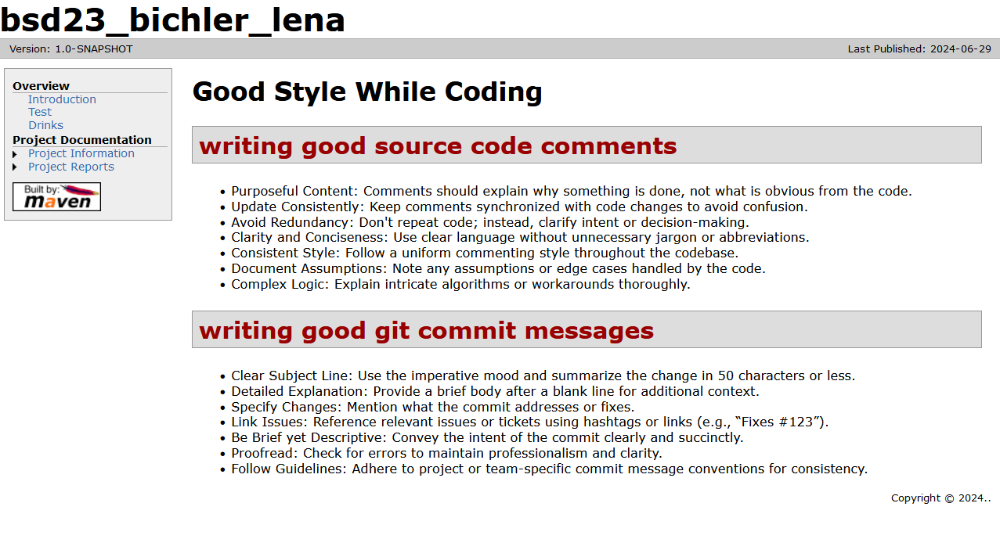
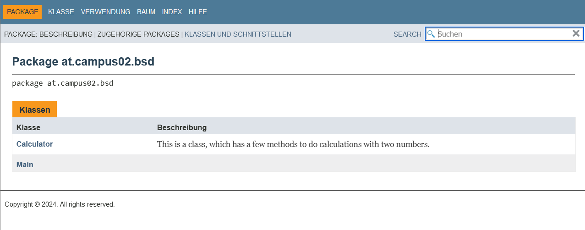
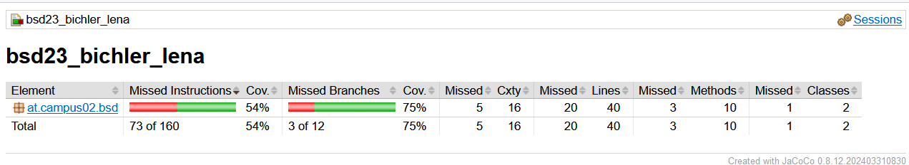

# Maven Site Documentation

## Configuration in pom.xml
To generate Maven Site documentation, you need to configure several aspects in your pom.xml:
- plugins
- javadoc
- Self-created Maven Site Documents
- mvn site Command: Use this Maven command to trigger the generation of the documentation 
site based on your configurations.
- JUnit Test Results
- Extended pom.xml Information
- Correct File Structure
- site.xml Document: This file specifies the structure and layout of
the generated maven site.

## Configuration Aspects in site.xml and pom.xml
### pom.xml:
- Project Meta-Data (groupId, Developer information,...)
- Plugins: build and reporting plugins
- Dependencies

### site.xml:
- Design and Layout
- Navigation: Menu Links
- Information about projects

## Images

